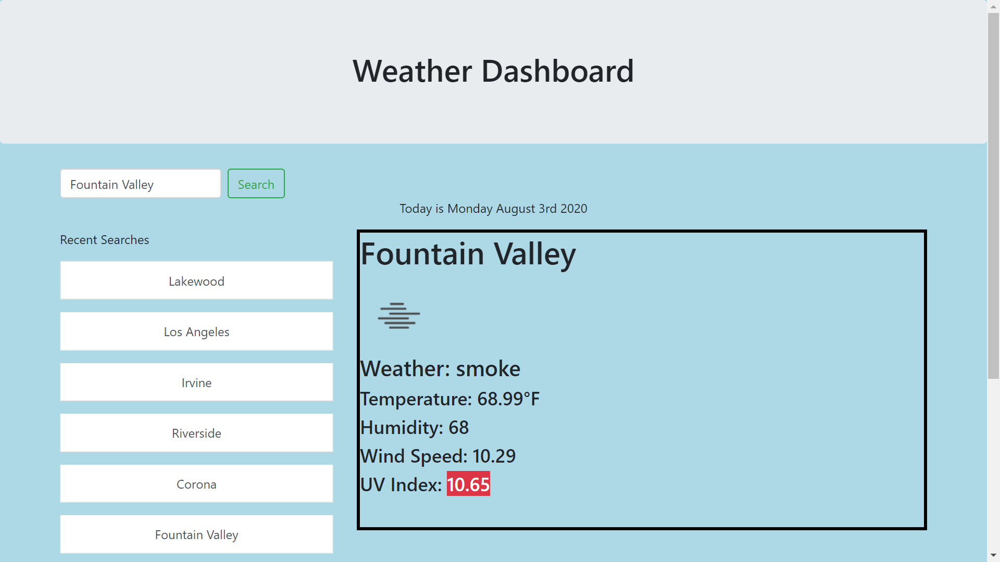
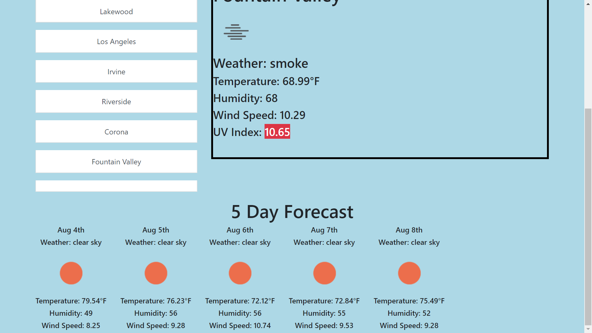

###Weather Dashboard
This application takes in any city and returns weather conditions including temperature, humidity, and wind speed. It also color codes the UV Index based on how severe it is. 

Additionally, it will show you the forecast for the next 5 days. 

The application will save a user's search history for easy access on future use. 

Utilized the OpenWeather API https://openweathermap.org/api 

The application can be found at https://e-park8.github.io/weatherDash/
